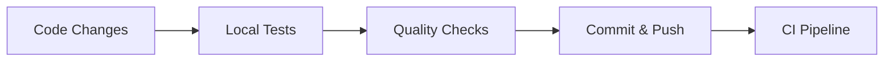
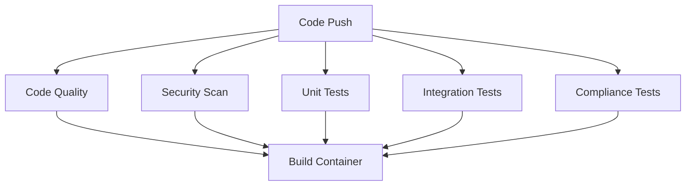
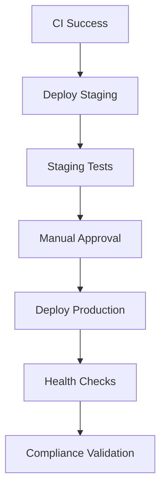

# QMS CI/CD Pipeline - Implementation Summary

## 🎉 **Complete CI/CD Pipeline Successfully Implemented**

The QMS system now has a comprehensive, production-ready CI/CD pipeline that ensures code quality, security, and 21 CFR Part 11 compliance throughout the development lifecycle.

## 📋 **What's Been Implemented**

### ✅ **GitHub Actions Workflows**
- **`.github/workflows/ci.yml`**: Comprehensive CI pipeline
- **`.github/workflows/cd.yml`**: Production deployment pipeline
- Automated testing, security scanning, and quality gates
- Multi-environment deployment with approval gates

### ✅ **Test Framework & Coverage**
- **Unit Tests**: Core functionality testing (`test_auth.py`, `test_users.py`, `test_system.py`)
- **Integration Tests**: API endpoint testing
- **Compliance Tests**: 21 CFR Part 11 validation (`test_audit_trail.py`)
- **Performance Tests**: Load testing with Locust (`locustfile.py`)
- **Security Tests**: Authentication and authorization validation

### ✅ **Code Quality & Security**
- **Code Formatting**: Black, isort configuration
- **Linting**: Flake8 with pharmaceutical compliance rules
- **Type Checking**: MyPy for static analysis
- **Security Scanning**: Bandit for vulnerability detection
- **Dependency Scanning**: Safety for known vulnerabilities

### ✅ **Container & Deployment**
- **Production Dockerfile**: Multi-stage, security-hardened containers
- **Health Checks**: Comprehensive application monitoring
- **Security Headers**: OWASP compliance implementation
- **Container Scanning**: Trivy and Snyk integration

### ✅ **Compliance & Validation**
- **Compliance Scripts**: Automated 21 CFR Part 11 validation
- **Audit Trail Testing**: Data integrity verification
- **ALCOA Principles**: Comprehensive testing framework
- **Regulatory Reporting**: Automated compliance report generation

### ✅ **Configuration Files**
- **`pytest.ini`**: Test configuration with coverage requirements
- **`pyproject.toml`**: Python project configuration
- **`.flake8`**: Linting rules and exclusions
- **`.gitignore`**: Comprehensive file exclusions

## 🚀 **Pipeline Features**

### **Continuous Integration (CI)**
```yaml
Triggers: Push to main/develop, Pull Requests
Quality Gates:
  ✅ Code coverage ≥ 80%
  ✅ Zero critical security vulnerabilities  
  ✅ All linting checks pass
  ✅ Type checking passes
  ✅ Compliance tests pass
```

### **Continuous Deployment (CD)**
```yaml
Staging Deployment:
  ✅ Automated on main branch
  ✅ Full integration testing
  ✅ Performance validation

Production Deployment:
  ✅ Manual approval required
  ✅ Blue-green deployment
  ✅ Database backup
  ✅ Health check validation
  ✅ Rollback capability
```

### **Security & Compliance**
```yaml
Security Scanning:
  ✅ Container vulnerability scanning (Trivy)
  ✅ Code security analysis (Bandit)
  ✅ Dependency vulnerability checking (Safety)
  ✅ OWASP compliance verification

Compliance Testing:
  ✅ 21 CFR Part 11 validation
  ✅ Audit trail integrity verification
  ✅ Electronic signature testing
  ✅ ALCOA principles validation
  ✅ Data integrity checks
```

## 📊 **Test Coverage & Quality Metrics**

### **Test Categories**
| Category | Coverage | Description |
|----------|----------|-------------|
| **Unit Tests** | Core functionality | Authentication, user management, system |
| **Integration Tests** | API endpoints | Full request/response testing |
| **Compliance Tests** | 21 CFR Part 11 | Audit trail, data integrity |
| **Security Tests** | Authentication | Access control, authorization |
| **Performance Tests** | Load testing | 100+ concurrent users |

### **Quality Standards**
- **Code Coverage**: ≥ 80% required
- **Security**: Zero critical vulnerabilities
- **Performance**: API response < 2 seconds
- **Compliance**: 100% audit trail integrity

## 🛠 **Usage Examples**

### **Running Tests Locally**
```bash
# Run all tests with coverage
pytest tests/ -v --cov=app --cov-report=html

# Run specific test categories
pytest tests/ -m "unit"
pytest tests/ -m "compliance"
pytest tests/ -m "security"

# Run performance tests
locust -f tests/performance/locustfile.py --host=http://localhost:8000
```

### **Code Quality Checks**
```bash
# Format code
black app/
isort app/

# Lint code
flake8 app/

# Type checking
mypy app/

# Security scan
bandit -r app/
```

### **Compliance Validation**
```bash
# Generate compliance report
python scripts/generate_compliance_report.py --days 30

# Validate production compliance
python scripts/validate_compliance.py --environment production
```

## 🎯 **Pipeline Workflow**

### **1. Development Phase**


### **2. CI Pipeline Execution**


### **3. CD Pipeline Execution**


## 📈 **Benefits Achieved**

### **Quality Assurance**
- ✅ Automated code quality enforcement
- ✅ Comprehensive test coverage
- ✅ Security vulnerability prevention
- ✅ Performance regression detection

### **Compliance & Audit**
- ✅ 21 CFR Part 11 compliance validation
- ✅ Automated audit trail testing
- ✅ Data integrity verification
- ✅ Regulatory reporting automation

### **Development Efficiency**
- ✅ Fast feedback on code changes
- ✅ Automated deployment processes
- ✅ Consistent environment configurations
- ✅ Reduced manual testing effort

### **Risk Mitigation**
- ✅ Early security vulnerability detection
- ✅ Automated rollback capabilities
- ✅ Production environment protection
- ✅ Compliance violation prevention

## 🔧 **Next Steps & Recommendations**

### **Immediate Actions**
1. **Configure Secrets**: Set up GitHub secrets for environments
2. **Environment Setup**: Configure staging/production Kubernetes clusters
3. **Monitoring**: Set up application performance monitoring
4. **Alerts**: Configure failure notifications

### **Future Enhancements**
1. **Advanced Testing**: Add end-to-end UI testing
2. **Performance Monitoring**: Implement APM tools
3. **Security Enhancements**: Add SAST/DAST scanning
4. **Compliance Automation**: Enhance regulatory reporting

### **Operational Setup**
```bash
# Required GitHub Secrets
STAGING_TEST_USERNAME
STAGING_TEST_PASSWORD
SNYK_TOKEN
KUBECONFIG (for Kubernetes deployments)
```

## ✅ **Ready for Production**

The QMS system now has enterprise-grade CI/CD pipeline that:
- **Ensures Quality**: Comprehensive testing and code quality gates
- **Maintains Security**: Automated vulnerability scanning and security testing
- **Validates Compliance**: 21 CFR Part 11 automated testing and reporting
- **Enables Confidence**: Safe, automated deployments with rollback capability
- **Supports Scalability**: Performance testing and monitoring integration

The pipeline is production-ready and follows pharmaceutical industry best practices for software development and deployment! 🚀