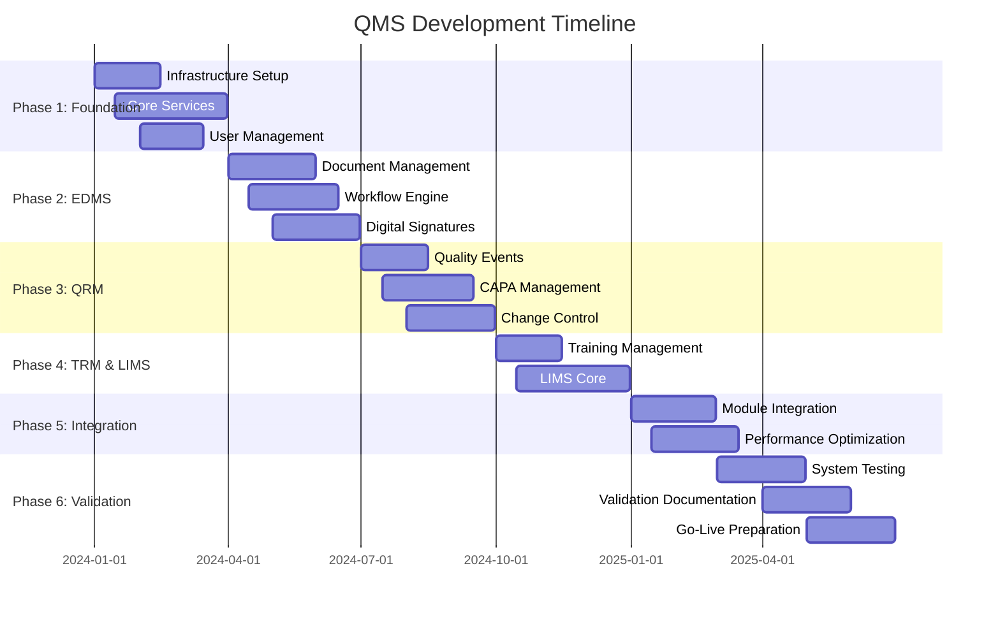
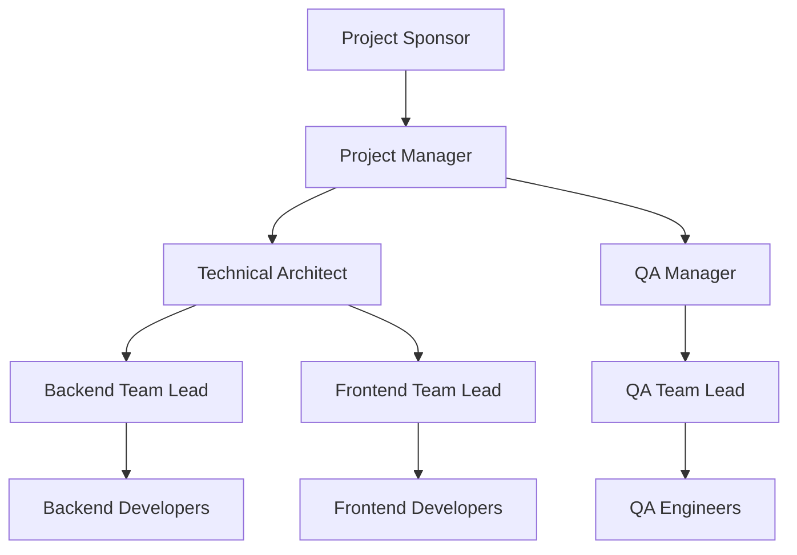

# QMS System - Detailed Development Roadmap & Project Management

## Table of Contents
1. [Project Overview & Timeline](#project-overview--timeline)
2. [Phase-by-Phase Implementation](#phase-by-phase-implementation)
3. [Team Structure & Responsibilities](#team-structure--responsibilities)
4. [Risk Management](#risk-management)
5. [Quality Assurance Strategy](#quality-assurance-strategy)
6. [Change Management](#change-management)
7. [Go-Live Strategy](#go-live-strategy)

## Project Overview & Timeline

### Executive Summary
**Project Duration**: 18 months
**Total Estimated Cost**: $2.5M - $3.2M
**Team Size**: 12-15 professionals
**Compliance Target**: 21 CFR Part 11, EU Annex 11, ISO 13485

### High-Level Timeline


### Resource Allocation by Phase
| Phase | Duration | Team Size | Budget Allocation | Key Deliverables |
|-------|----------|-----------|-------------------|------------------|
| Phase 1 | 3 months | 8 people | $450K (15%) | Infrastructure, Core Services |
| Phase 2 | 3 months | 10 people | $600K (20%) | EDMS Module |
| Phase 3 | 3 months | 12 people | $750K (25%) | QRM Module |
| Phase 4 | 3 months | 12 people | $600K (20%) | TRM & LIMS Modules |
| Phase 5 | 3 months | 10 people | $375K (12.5%) | Integration & Optimization |
| Phase 6 | 3 months | 8 people | $225K (7.5%) | Validation & Deployment |

## Phase-by-Phase Implementation

### Phase 1: Foundation (Months 1-3)

#### Objectives
- Establish development infrastructure
- Implement core authentication and authorization
- Create audit trail foundation
- Set up CI/CD pipelines

#### Detailed Work Breakdown

**Week 1-2: Project Initiation**
```yaml
Infrastructure Setup:
  - Server provisioning (Dev/Staging/Prod)
  - Container orchestration setup (Podman)
  - Database cluster installation (PostgreSQL 18)
  - Network security configuration
  - SSL certificate setup
  
Development Environment:
  - Git repository setup with branching strategy
  - Docker development containers
  - IDE configuration and coding standards
  - Code quality tools (ESLint, Prettier, SonarQube)
```

**Week 3-4: Core Backend Architecture**
```python
# Core Services Implementation Schedule
Authentication Service:
  - JWT token management
  - Password hashing and validation
  - Session management
  - MFA integration framework

Authorization Service:
  - Role-based access control (RBAC)
  - Permission matrix implementation
  - Resource-level access control
  - API endpoint protection

Audit Trail Service:
  - Database triggers for all tables
  - Immutable log storage
  - Search and filtering capabilities
  - Compliance reporting framework
```

**Week 5-8: User Management Module**
```typescript
// Frontend Components Development
UserManagement:
  Components:
    - UserList.tsx
    - UserProfile.tsx
    - RoleAssignment.tsx
    - PermissionMatrix.tsx
  
  Features:
    - User CRUD operations
    - Role management interface
    - Permission visualization
    - Activity monitoring dashboard
```

**Week 9-12: Testing & Documentation**
- Unit test coverage (>90%)
- Integration testing
- Security penetration testing
- API documentation (OpenAPI/Swagger)
- User manual drafts

#### Deliverables & Acceptance Criteria
✅ **Infrastructure Checklist**
- [ ] All environments operational (Dev/Staging/Prod)
- [ ] Database replication configured
- [ ] Backup systems tested
- [ ] Security scanning passed
- [ ] Performance baseline established

✅ **Code Quality Metrics**
- [ ] Unit test coverage > 90%
- [ ] Code review process established
- [ ] Static analysis passing
- [ ] Security scan results acceptable
- [ ] Performance benchmarks met

### Phase 2: EDMS Module (Months 4-6)

#### Sprint Planning (2-week sprints)

**Sprint 1-2: Document Core**
```python
# Backend Development Focus
Document Models:
  - Document entity with versioning
  - File storage integration (MinIO)
  - Metadata extraction services
  - Search indexing (Elasticsearch)

Document Service:
  - CRUD operations
  - Version control logic
  - File processing pipeline
  - Dependency tracking
```

**Sprint 3-4: Workflow Engine**
```python
# Workflow Implementation
WorkflowEngine:
  Classes:
    - WorkflowDefinition
    - WorkflowInstance
    - WorkflowStep
    - WorkflowTransition
  
  Features:
    - State machine implementation
    - Parallel/sequential routing
    - Conditional logic support
    - Timeout handling
```

**Sprint 5-6: Digital Signatures**
```python
# Digital Signature Service
DigitalSignatureService:
  Components:
    - PKI certificate management
    - Signature creation/verification
    - Timestamp authority integration
    - PDF annotation and signing
  
  Compliance:
    - 21 CFR Part 11 requirements
    - Non-repudiation guarantees
    - Long-term signature validity
```

#### Quality Gates
- **Code Review**: All code reviewed by senior developer
- **Security Review**: Security team approval for cryptographic components
- **Performance Testing**: Response time <2s for document operations
- **User Acceptance**: End-user testing with pharmaceutical team

### Phase 3: QRM Module (Months 7-9)

#### Feature Development Priority

**Priority 1: Quality Events (Weeks 1-4)**
```yaml
QualityEventManagement:
  CoreFeatures:
    - Event reporting interface
    - Severity classification
    - Impact assessment
    - Automatic notifications
  
  Workflows:
    - Event investigation
    - Root cause analysis
    - Escalation procedures
    - Closure approval
```

**Priority 2: CAPA System (Weeks 5-8)**
```yaml
CAPAManagement:
  Features:
    - Action planning interface
    - Resource allocation
    - Timeline management
    - Effectiveness verification
  
  Integration:
    - Link to quality events
    - Document references
    - Training requirements
    - Change control triggers
```

**Priority 3: Change Control (Weeks 9-12)**
```yaml
ChangeControlSystem:
  Components:
    - Change request forms
    - Impact assessment tools
    - Approval workflows
    - Implementation tracking
  
  Compliance:
    - Risk assessment integration
    - Validation requirements
    - Documentation updates
    - Post-implementation review
```

### Phase 4: TRM & LIMS (Months 10-12)

#### Parallel Development Streams

**Stream A: Training Management**
```typescript
// TRM Module Architecture
TrainingManagement:
  Components:
    - CurriculumBuilder
    - TrainingAssignment
    - ProgressTracking
    - CompetencyAssessment
  
  Automation:
    - Retraining triggers
    - Certification expiry alerts
    - Compliance reporting
    - Skills gap analysis
```

**Stream B: LIMS Foundation**
```python
# LIMS Core Implementation
LIMSCore:
  Modules:
    - SampleManagement
    - InventoryTracking
    - EquipmentCalibration
    - TestManagement
  
  DataIntegrity:
    - Chain of custody
    - Result verification
    - Instrument integration
    - Statistical analysis
```

### Phase 5: Integration & Optimization (Months 13-15)

#### Integration Testing Strategy
```yaml
CrossModuleIntegration:
  TestScenarios:
    - Document training triggers
    - Quality event to CAPA flow
    - Change control to document updates
    - LIMS to quality events
  
  PerformanceTesting:
    - Load testing (1000+ concurrent users)
    - Stress testing (peak load simulation)
    - Volume testing (large document uploads)
    - Endurance testing (24-hour runs)
```

#### Performance Optimization
```python
# Performance Improvement Areas
OptimizationTargets:
  Database:
    - Query optimization
    - Index tuning
    - Connection pooling
    - Read replica utilization
  
  Application:
    - Caching strategies (Redis)
    - Async processing (Celery)
    - CDN integration
    - Image optimization
  
  Frontend:
    - Code splitting
    - Lazy loading
    - Service worker caching
    - Bundle optimization
```

### Phase 6: Validation & Deployment (Months 16-18)

#### Validation Protocol

**Installation Qualification (IQ)**
```yaml
IQTesting:
  Infrastructure:
    - Hardware specifications verified
    - Software versions documented
    - Network configuration validated
    - Security controls implemented
  
  Documentation:
    - Installation procedures
    - Configuration management
    - Environment specifications
    - Change control procedures
```

**Operational Qualification (OQ)**
```yaml
OQTesting:
  FunctionalTesting:
    - All features operational
    - Workflow testing complete
    - Integration points verified
    - Error handling validated
  
  PerformanceTesting:
    - Response time requirements
    - Concurrent user limits
    - System availability targets
    - Recovery procedures
```

**Performance Qualification (PQ)**
```yaml
PQTesting:
  BusinessProcesses:
    - End-to-end workflow testing
    - User acceptance testing
    - Compliance verification
    - Training effectiveness
  
  Documentation:
    - Validation summary report
    - Traceability matrix
    - Risk assessment
    - Compliance certification
```

## Team Structure & Responsibilities

### Core Team Composition

#### Technical Leadership
```yaml
ProjectManager:
  Role: Overall project coordination
  Responsibilities:
    - Timeline management
    - Resource allocation
    - Stakeholder communication
    - Risk mitigation
  
TechnicalArchitect:
  Role: System design and technical decisions
  Responsibilities:
    - Architecture design
    - Technology selection
    - Code review oversight
    - Performance optimization

QualityAssuranceManager:
  Role: Quality and compliance oversight
  Responsibilities:
    - Test strategy development
    - Validation planning
    - Compliance verification
    - Risk assessment
```

#### Development Teams

**Backend Team (4 developers)**
```python
# Team Structure
SeniorBackendDeveloper:
  Focus: Core services, database design
  Skills: Python, PostgreSQL, Redis, Celery
  
BackendDeveloper_API:
  Focus: API development, authentication
  Skills: FastAPI, JWT, OAuth2, Security
  
BackendDeveloper_Integration:
  Focus: Third-party integrations, workflows
  Skills: REST APIs, Message queues, ETL
  
BackendDeveloper_DevOps:
  Focus: Infrastructure, deployment, monitoring
  Skills: Docker, Nginx, Prometheus, Linux
```

**Frontend Team (3 developers)**
```typescript
// Team Composition
SeniorFrontendDeveloper:
  Focus: Architecture, component design
  Skills: React, TypeScript, Redux, Material-UI
  
FrontendDeveloper_UX:
  Focus: User interface, user experience
  Skills: CSS, Responsive design, Accessibility
  
FrontendDeveloper_Integration:
  Focus: API integration, state management
  Skills: React Query, Form handling, Testing
```

**QA Team (3 testers)**
```yaml
QATeamStructure:
  AutomationEngineer:
    Focus: Test automation, CI/CD integration
    Skills: Selenium, Jest, Cypress, Python
  
  ManualTester:
    Focus: Functional testing, user acceptance
    Skills: Test case design, Bug reporting
  
  SecurityTester:
    Focus: Security testing, compliance
    Skills: OWASP, Penetration testing, Compliance
```

### Communication & Collaboration

#### Daily Operations
- **Daily Standups**: 15-minute status updates
- **Sprint Planning**: Bi-weekly sprint planning sessions
- **Code Reviews**: All code reviewed before merge
- **Technical Discussions**: Weekly architecture reviews

#### Reporting Structure


## Risk Management

### Technical Risks

**High-Risk Items**
| Risk | Impact | Probability | Mitigation Strategy |
|------|--------|-------------|-------------------|
| Digital signature compliance | High | Medium | Early prototype, regulatory consultation |
| Database performance at scale | High | Medium | Load testing, optimization sprints |
| Integration complexity | Medium | High | Proof of concepts, incremental integration |
| Security vulnerabilities | High | Low | Security reviews, penetration testing |

**Medium-Risk Items**
| Risk | Impact | Probability | Mitigation Strategy |
|------|--------|-------------|-------------------|
| Third-party dependency issues | Medium | Medium | Vendor evaluation, alternatives identified |
| Team knowledge gaps | Medium | Medium | Training programs, knowledge sharing |
| Scope creep | Medium | High | Change control process, stakeholder management |

### Project Risks

**Resource Risks**
- **Key person dependency**: Cross-training, documentation
- **Budget overruns**: Regular budget reviews, scope management
- **Timeline delays**: Buffer time, parallel development

**Compliance Risks**
- **Regulatory changes**: Regular regulatory monitoring
- **Validation failures**: Early validation activities
- **Audit findings**: Internal audits, compliance reviews

This comprehensive roadmap provides the detailed planning framework for implementing the QMS system. The documentation suite is now complete with technical architecture, database design, API specifications, compliance requirements, and operational procedures.

Would you like me to suggest next steps for getting started with implementation, or would you prefer me to elaborate on any specific aspect of the roadmap?