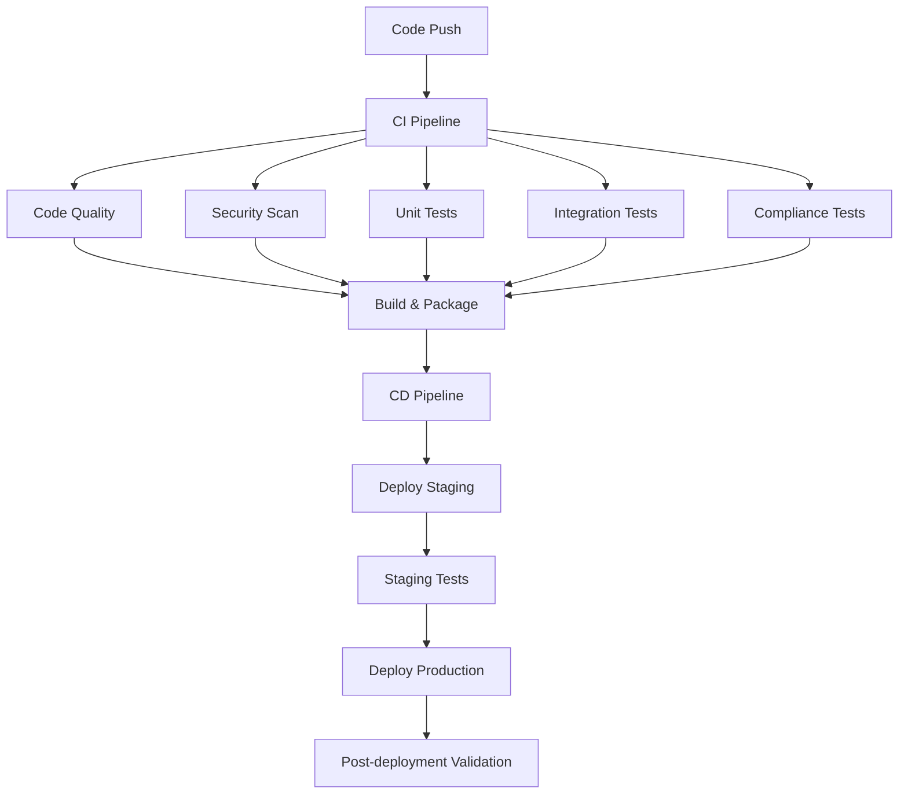

# QMS CI/CD Pipeline Documentation

## Overview

This document describes the Continuous Integration and Continuous Deployment (CI/CD) pipeline for the QMS Pharmaceutical System. The pipeline ensures code quality, security, compliance, and automated deployment while maintaining 21 CFR Part 11 requirements.

## Pipeline Architecture



## CI Pipeline Components

### 1. Code Quality & Security (.github/workflows/ci.yml)

**Code Formatting & Linting:**
- **Black**: Code formatting (127 char line length)
- **isort**: Import sorting
- **Flake8**: Linting and style checks
- **MyPy**: Static type checking

**Security Scanning:**
- **Bandit**: Security vulnerability scanning
- **Safety**: Dependency vulnerability checking
- **OWASP compliance**: XSS, SQL injection prevention

**Quality Gates:**
- Minimum 80% test coverage
- Zero critical security vulnerabilities
- All linting checks must pass
- Type checking must pass

### 2. Automated Testing

**Test Categories:**
```python
# Unit Tests
@pytest.mark.unit
def test_user_creation():
    pass

# Integration Tests  
@pytest.mark.integration
def test_api_endpoints():
    pass

# Compliance Tests
@pytest.mark.compliance
def test_audit_trail():
    pass

# Security Tests
@pytest.mark.security
def test_authentication():
    pass

# Performance Tests
@pytest.mark.performance
def test_load_handling():
    pass
```

**Test Environment:**
- PostgreSQL 18 test database
- Redis test cache
- Isolated test containers
- Mocked external services

### 3. Compliance Testing

**21 CFR Part 11 Validation:**
- Audit trail integrity verification
- Electronic signature validation
- Data integrity checks
- ALCOA principles compliance
- User access control testing

**Test Coverage:**
- Authentication & authorization
- Audit logging functionality
- Data integrity verification
- Electronic records compliance
- System security controls

### 4. Performance Testing

**Load Testing with Locust:**
```python
# Example load test configuration
class QMSUser(HttpUser):
    wait_time = between(1, 3)
    
    @task(3)
    def view_system_info(self):
        self.client.get("/api/v1/system/info")
    
    @task(1)
    def create_user(self):
        self.client.post("/api/v1/users/", json=user_data)
```

**Performance Criteria:**
- API response time < 2 seconds
- System supports 100+ concurrent users
- Database queries optimized
- Memory usage within limits

## CD Pipeline Components

### 1. Container Build & Security (.github/workflows/cd.yml)

**Multi-stage Docker Build:**
```dockerfile
# Production-optimized container
FROM python:3.11-slim as production
# Security: Non-root user, minimal attack surface
USER qms
HEALTHCHECK --interval=30s --timeout=10s CMD curl -f http://localhost:8000/health
```

**Container Security:**
- Trivy vulnerability scanning
- Snyk security analysis
- SBOM (Software Bill of Materials) generation
- Distroless base images where possible

### 2. Deployment Strategy

**Staging Environment:**
- Automated deployment on main branch
- Full integration testing
- Performance validation
- Security penetration testing

**Production Environment:**
- Manual approval required
- Blue-green deployment
- Database backup before deployment
- Rollback capability
- Health checks and monitoring

### 3. Environment Configuration

**Staging Values:**
```yaml
# helm/qms-system/values-staging.yaml
environment: staging
replicas: 2
resources:
  requests:
    memory: "512Mi"
    cpu: "250m"
ingress:
  hosts:
    - host: qms-staging.company.com
```

**Production Values:**
```yaml
# helm/qms-system/values-production.yaml
environment: production
replicas: 3
resources:
  requests:
    memory: "1Gi" 
    cpu: "500m"
ingress:
  hosts:
    - host: qms.company.com
```

## Quality Gates

### Code Quality Gates
- ✅ Code coverage ≥ 80%
- ✅ Zero critical/high security vulnerabilities
- ✅ All linting checks pass
- ✅ Type checking passes
- ✅ Documentation updated

### Security Gates
- ✅ Container vulnerability scan passes
- ✅ Dependency vulnerability scan passes
- ✅ Security headers implemented
- ✅ Authentication/authorization tests pass
- ✅ OWASP compliance verified

### Compliance Gates
- ✅ Audit trail functionality verified
- ✅ 21 CFR Part 11 compliance tests pass
- ✅ Data integrity checks pass
- ✅ Electronic signature capability verified
- ✅ ALCOA principles compliance verified

### Performance Gates
- ✅ Load testing passes (100+ users)
- ✅ API response times < 2s
- ✅ Database performance acceptable
- ✅ Memory/CPU usage within limits

## Monitoring & Alerting

### Health Checks
```python
# Comprehensive health check
@app.get("/health")
async def health_check():
    return {
        "status": "healthy",
        "timestamp": datetime.utcnow(),
        "version": settings.APP_VERSION,
        "components": {
            "database": db_health_check(),
            "redis": redis_health_check(),
            "audit_trail": audit_health_check()
        }
    }
```

### Metrics Collection
- Application performance metrics
- Database performance metrics
- User activity metrics
- Security event metrics
- Compliance metrics

### Alerting
- Failed deployments
- Security incidents
- Performance degradation
- Compliance violations
- System errors

## Compliance Reporting

### Automated Reports
```bash
# Generate compliance report
python scripts/generate_compliance_report.py --days 30 --output compliance-report.json

# Validate compliance
python scripts/validate_compliance.py --environment production
```

### Report Contents
- Audit trail integrity status
- Security compliance status
- Performance metrics
- User activity summary
- Compliance recommendations

## Development Workflow

### 1. Feature Development
```bash
# Create feature branch
git checkout -b feature/new-feature

# Run local tests
pytest tests/ -v

# Run code quality checks
black app/
isort app/
flake8 app/
mypy app/

# Commit and push
git commit -m "feat: add new feature"
git push origin feature/new-feature
```

### 2. Pull Request Process
1. Create pull request
2. Automated CI pipeline runs
3. Code review required
4. All checks must pass
5. Merge to main branch

### 3. Deployment Process
1. Merge triggers CI/CD pipeline
2. Automated staging deployment
3. Staging validation tests
4. Manual production approval
5. Production deployment
6. Post-deployment validation

## Troubleshooting

### Common Issues

**Test Failures:**
```bash
# Run specific test category
pytest tests/ -m "unit"
pytest tests/ -m "integration"
pytest tests/ -m "compliance"

# Debug test with verbose output
pytest tests/test_auth.py::test_login_success -v --tb=long
```

**Security Scan Failures:**
```bash
# Run security scans locally
bandit -r app/ -f json
safety check --json
```

**Performance Issues:**
```bash
# Run local performance test
locust -f tests/performance/locustfile.py --host=http://localhost:8000
```

### Pipeline Debugging

**Check Pipeline Status:**
- GitHub Actions tab
- Review pipeline logs
- Check artifact uploads
- Verify environment variables

**Local Validation:**
```bash
# Validate compliance locally
python scripts/validate_compliance.py --api-url http://localhost:8000

# Generate local compliance report
python scripts/generate_compliance_report.py --days 7
```

## Security Considerations

### Secrets Management
- GitHub Secrets for sensitive data
- Kubernetes Secrets for runtime
- Encrypted environment variables
- Certificate management

### Access Control
- Branch protection rules
- Required reviews
- Status checks required
- Admin enforcement

### Audit Trail
- All pipeline activities logged
- Deployment history maintained
- Compliance reports archived
- Security scan results stored

## Maintenance

### Regular Tasks
- Update dependencies monthly
- Review security scan results
- Update compliance reports
- Performance baseline updates

### Pipeline Updates
- Review and update quality gates
- Add new test categories
- Update security scanning tools
- Enhance monitoring capabilities

This CI/CD pipeline ensures that the QMS system maintains the highest standards of quality, security, and regulatory compliance throughout the development and deployment lifecycle.