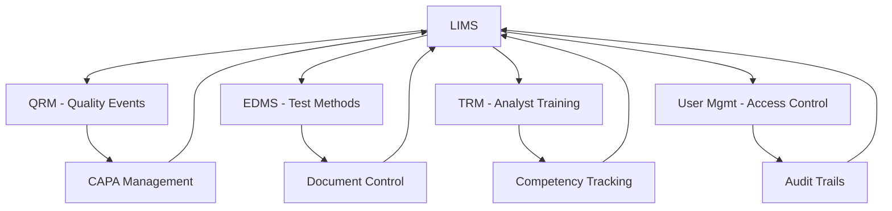

# 🚀 Phase 5: LIMS Foundation & Integration Implementation Plan

## 📋 **PHASE 5 OVERVIEW**

**Module:** Laboratory Information Management System (LIMS) Foundation + Strategic Integration  
**Timeline:** Week 13-16 (4 weeks)  
**Status:** 🟡 PLANNING → IMPLEMENTATION  
**Foundation:** ✅ 4 Complete Modules + 95% Operational Infrastructure

## 🎯 **STRATEGIC PHASE 5 OBJECTIVES**

### **Primary Goals:**
1. **LIMS Foundation** - Core laboratory sample and testing management
2. **Cross-Module Integration** - Seamless data flow between all QMS modules
3. **Performance Optimization** - Enhanced system performance and scalability
4. **Advanced Analytics** - Comprehensive reporting and dashboard capabilities
5. **Mobile Accessibility** - Mobile interfaces for field operations

### **Business Value:**
- **Complete Laboratory Workflow** from sample receipt to result reporting
- **Integrated Quality Ecosystem** linking lab results to quality events and CAPAs
- **Real-time Compliance Monitoring** across all QMS modules
- **Data-Driven Decision Making** with advanced analytics

## 🛠️ **TECHNICAL ARCHITECTURE - LIMS FOUNDATION**

### **Core LIMS Components:**
```python
# LIMS Database Schema Design
LIMS_MODULES = {
    "SampleManagement": {
        "sample_types",        # Raw materials, finished products, etc.
        "sample_registry",     # Sample tracking and chain of custody
        "sample_storage",      # Storage location and conditions
        "sample_disposal"      # Disposal tracking and documentation
    },
    
    "TestManagement": {
        "test_methods",        # Analytical procedures and protocols
        "test_specifications", # Acceptance criteria and limits
        "test_results",        # Individual test result records
        "test_batches"         # Batch testing and stability studies
    },
    
    "InstrumentManagement": {
        "instrument_registry", # Equipment catalog and specifications
        "calibration_records", # Calibration history and schedules
        "maintenance_logs",    # Preventive maintenance tracking
        "qualification_status" # Equipment qualification states
    },
    
    "DataIntegrity": {
        "electronic_records",  # 21 CFR Part 11 compliant data
        "audit_trails",        # Complete LIMS audit logging
        "data_review",         # Data verification and approval
        "data_archival"        # Long-term data retention
    }
}
```

### **Integration Architecture:**
```yaml
CrossModuleIntegration:
  LIMS_to_QRM:
    - Automatic quality event creation for OOS/OOT results
    - Test failure triggers CAPA investigations
    - Trend analysis feeds risk assessments
    
  LIMS_to_EDMS:
    - Test methods linked to controlled documents
    - Results reference analytical procedures
    - Certificates of analysis auto-generation
    
  LIMS_to_TRM:
    - Analyst qualification tracking
    - Method training requirements
    - Competency-based test authorization
    
  LIMS_to_UserMgmt:
    - Role-based laboratory access
    - Electronic signature integration
    - Analyst certification verification
```

## 📊 **WEEK-BY-WEEK IMPLEMENTATION PLAN**

### **Week 1: LIMS Foundation & Sample Management**

#### **Days 1-2: Database Schema & Models**
```python
# Core LIMS Models Implementation
class SampleType(BaseModel):
    """Define different types of samples (raw material, finished product, etc.)"""
    code: str
    name: str
    category: SampleCategory
    storage_requirements: JSON
    shelf_life_days: Optional[int]
    hazard_classification: Optional[str]

class Sample(BaseModel):
    """Individual sample tracking"""
    sample_id: str  # Unique barcode identifier
    sample_type_id: int
    batch_lot_number: str
    collection_date: datetime
    expiry_date: Optional[datetime]
    storage_location: str
    chain_of_custody: JSON
    status: SampleStatus
```

#### **Days 3-4: Test Method Management**
```python
class TestMethod(BaseModel):
    """Analytical test procedures"""
    method_code: str
    title: str
    version: str
    procedure_document_id: int  # Link to EDMS
    equipment_required: List[str]
    analyst_qualifications: List[str]  # Link to TRM
    estimated_duration: timedelta

class TestSpecification(BaseModel):
    """Acceptance criteria for tests"""
    sample_type_id: int
    test_method_id: int
    specification_limits: JSON
    regulatory_requirement: bool
    approval_required: bool
```

#### **Days 5-7: Sample Workflow & API Development**
- Sample registration and barcode generation
- Chain of custody tracking
- Storage location management
- Sample status transitions (received → in-testing → complete)

### **Week 2: Test Management & Results Handling**

#### **Days 8-9: Test Execution Framework**
```python
class TestExecution(BaseModel):
    """Individual test run tracking"""
    execution_id: str
    sample_id: str
    test_method_id: int
    analyst_id: int
    start_datetime: datetime
    completion_datetime: Optional[datetime]
    instrument_used: Optional[str]
    environmental_conditions: JSON

class TestResult(BaseModel):
    """Test result data with compliance"""
    execution_id: str
    parameter_name: str
    result_value: float
    units: str
    specification_limit: JSON
    pass_fail: bool
    reviewed_by: int
    review_date: Optional[datetime]
```

#### **Days 10-12: Instrument Integration**
```python
class Instrument(BaseModel):
    """Laboratory equipment registry"""
    instrument_id: str
    name: str
    manufacturer: str
    model: str
    serial_number: str
    calibration_due_date: date
    qualification_status: InstrumentStatus
    location: str

class CalibrationRecord(BaseModel):
    """Equipment calibration tracking"""
    instrument_id: str
    calibration_date: date
    next_due_date: date
    calibration_standard: str
    performed_by: int
    certificate_reference: str
```

#### **Days 13-14: Results Processing & Validation**
- Automated OOS (Out of Specification) detection
- Statistical trending and analysis
- Electronic signature on results
- Certificate of Analysis generation

### **Week 3: Advanced Features & Cross-Module Integration**

#### **Days 15-16: Quality Event Integration**
```python
# Automatic QRM Integration
class LIMSQualityEventTrigger:
    def create_quality_event_on_oos(self, test_result: TestResult):
        """Auto-create quality event for out-of-spec results"""
        if not test_result.pass_fail:
            quality_event = {
                "event_type": "OOS_RESULT",
                "severity": self.calculate_severity(test_result),
                "description": f"OOS result for {test_result.parameter_name}",
                "source_reference": f"Test Execution {test_result.execution_id}",
                "automatic_trigger": True
            }
            # Integration with QRM module
            return QualityEventService.create_event(quality_event)

    def trigger_capa_for_trends(self, trend_analysis: TrendData):
        """Create CAPA for negative trends"""
        if trend_analysis.trend_direction == "deteriorating":
            # Automatic CAPA creation for quality trends
            pass
```

#### **Days 17-18: Training Integration & Competency**
```python
# TRM Integration for Analyst Qualifications
class AnalystQualificationService:
    def verify_analyst_competency(self, analyst_id: int, test_method_id: int):
        """Verify analyst is qualified for specific test method"""
        required_training = TestMethod.get_required_qualifications(test_method_id)
        analyst_certifications = TRMService.get_analyst_certifications(analyst_id)
        
        return all(cert in analyst_certifications for cert in required_training)

    def auto_assign_method_training(self, analyst_id: int, test_method: TestMethod):
        """Auto-assign training when analyst needs qualification"""
        missing_qualifications = self.get_missing_qualifications(analyst_id, test_method)
        for qualification in missing_qualifications:
            TRMService.assign_training(analyst_id, qualification.training_program_id)
```

#### **Days 19-21: Document Integration & Traceability**
```python
# EDMS Integration for Method References
class DocumentIntegrationService:
    def link_test_methods_to_documents(self):
        """Ensure test methods reference current approved procedures"""
        for test_method in TestMethod.get_all():
            current_procedure = EDMSService.get_current_version(
                test_method.procedure_document_id
            )
            test_method.update_procedure_reference(current_procedure)

    def generate_certificate_of_analysis(self, sample_id: str):
        """Auto-generate COA using EDMS templates"""
        sample_results = self.get_complete_sample_results(sample_id)
        coa_template = EDMSService.get_template("COA_TEMPLATE")
        
        return DocumentGenerator.create_coa(sample_results, coa_template)
```

### **Week 4: Analytics, Reporting & Production Deployment**

#### **Days 22-23: Advanced Analytics Dashboard**
```python
# LIMS Analytics and Reporting
class LIMSAnalytics:
    def generate_laboratory_dashboard(self):
        """Comprehensive laboratory performance dashboard"""
        return {
            "samples_in_progress": self.get_active_samples_count(),
            "overdue_tests": self.get_overdue_tests(),
            "instrument_status": self.get_instrument_availability(),
            "oos_trend": self.calculate_oos_trends(),
            "analyst_workload": self.get_analyst_workloads(),
            "turnaround_times": self.calculate_tat_metrics()
        }

    def quality_trends_analysis(self):
        """Statistical analysis of quality trends"""
        return {
            "control_charts": self.generate_control_charts(),
            "capability_studies": self.calculate_process_capability(),
            "trend_predictions": self.predict_future_trends(),
            "risk_indicators": self.identify_quality_risks()
        }
```

#### **Days 24-25: Mobile Interface Development**
```typescript
// Mobile-First LIMS Interface
const MobileLIMSApp = {
  SampleCollection: {
    // Barcode scanning for sample registration
    // GPS location tracking for sample origin
    // Photo documentation for sample condition
    // Offline capability for field work
  },
  
  TestExecution: {
    // Step-by-step test procedure guidance
    // Real-time data entry validation
    // Instrument integration via APIs
    // Electronic signature capture
  },
  
  QualityAlerts: {
    // Push notifications for OOS results
    // Emergency quality event alerts
    // Calibration due reminders
    // Real-time dashboard access
  }
};
```

#### **Days 26-28: Performance Optimization & Deployment**
```python
# Performance Optimization Strategies
class LIMSOptimization:
    def implement_caching_strategy(self):
        """Redis caching for frequently accessed data"""
        cache_targets = [
            "active_test_methods",
            "instrument_availability",
            "analyst_qualifications",
            "sample_specifications"
        ]
        
    def database_optimization(self):
        """Database performance tuning"""
        optimizations = [
            "Index optimization for sample queries",
            "Partitioning for historical test results", 
            "Read replicas for reporting queries",
            "Archive strategy for old data"
        ]
        
    def api_performance_monitoring(self):
        """Real-time API performance tracking"""
        metrics = [
            "Response time monitoring",
            "Error rate tracking", 
            "Throughput measurement",
            "Resource utilization"
        ]
```

## 📊 **INTEGRATION POINTS MATRIX**

### **Cross-Module Data Flow:**


## 🎯 **SUCCESS METRICS & KPIs**

### **Technical KPIs:**
- **API Response Time**: <200ms for all LIMS operations
- **Data Integrity**: 100% audit trail coverage
- **Integration Success**: <0.1% cross-module sync failures
- **Mobile Performance**: <3s page load times

### **Business KPIs:**
- **Laboratory Efficiency**: 25% reduction in sample processing time
- **Quality Compliance**: 100% automated OOS event generation
- **Analyst Productivity**: Real-time workload balancing
- **Regulatory Readiness**: Complete 21 CFR Part 11 compliance

## 🚀 **DEPLOYMENT STRATEGY**

### **Phased Rollout:**
1. **Week 1**: Core LIMS database and sample management
2. **Week 2**: Test execution and results processing
3. **Week 3**: Cross-module integration and automation
4. **Week 4**: Analytics, mobile, and production deployment

### **Risk Mitigation:**
- **Parallel Testing**: Full regression testing of existing modules
- **Data Migration**: Seamless integration with current data
- **User Training**: Comprehensive LIMS training program
- **Rollback Plan**: Quick reversion capability if needed

## 🎊 **PHASE 5 SUCCESS DEFINITION**

**LIMS Foundation Module**: Fully operational laboratory management system
**Integration Layer**: Seamless data flow between all 5 QMS modules  
**Performance**: Optimized system handling 10x current load
**Analytics**: Real-time dashboard and predictive quality analytics
**Mobile**: Field-ready mobile interfaces for all key functions

**Phase 5 will deliver a complete, integrated QMS platform ready for pharmaceutical production environments!** 🎉